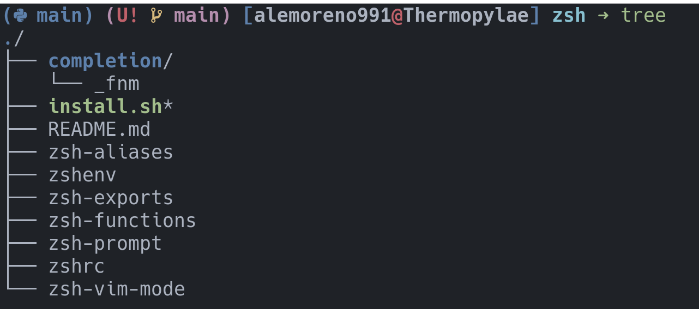
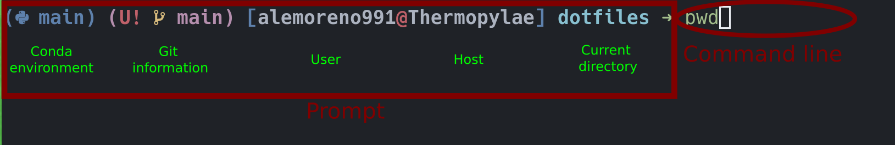

Zsh
---

# Motivation

Zsh is a shell that offers nice features with just a couple configurations.

- Autocompletion 
- Highlighting
- Colors

I also installed some programs to make it even more user-friendly 

- **Ranger:** it's a console file manager with VI key bindings [link](https://ranger.github.io/)
- **Zoxide:** it's a smarter `cd` command [link](https://github.com/ajeetdsouza/zoxide)
- **fnm:** Node.js version manager [link](https://github.com/Schniz/fnm)
- **ncdu:** command line tool to view and analyse disk space usage [link](https://dev.yorhel.nl/ncdu) 
- **tree:** is a command-line program used display the content of a directory in a tree-like format [link](https://linux.die.net/man/1/tree)

# Installation 

I don't even know if this should be called an installation. But, my goal is to demystify the process.

There is no magic here. You're just "copy and pasting" files and directories in specific locations 
of your system so that your operative system can find them. In addition, you're doing it smartly 
so that if you change those files (because you don't longer like some configuration or because 
you found a better way to do something) you can easily save your changes in a version control system,
like `git`.

It's worth mention that the configuration files are not actually copy/pasted. Instead, a 
slightly more sophisticated method called `symlink` or symbolic link. It basically 
mirrors the original file into a particular location. Thus, if the mirror file (`symlink`) is 
modified, the original is equally modified, and vice versa. 

# Explanation of the Configuration

The following image shows how the `dotfiles/zsh` directory is structured.

The **really** important parts you'll probably want to modify along the way are the following files:

- **zshrc:** is in charge of loading all your configurations when you launch a new shell, which 
happens every time you launch a new terminal emulator.

- **zsh-aliases:** is where you should put all your aliases (how you'd like to call your programs).

- **zsh-exports:** is where you should put all the environment variables you care to export,
so that the OS knows they exist.

- **zsh-vim-mode:** is where the vim-like behavior of the command line is set. 

Most likely, you won't need to modify the rest of the files. 

- **zsh-prompt:** is where the prompt is configured to look the way it looks.

- **zshenv:** this is an special file that __MUST__ be located at your `$HOME`. It tells the OS 
where to find the `.zshrc` file that loads your configurations. 

 
# Teaching Moment 

Here is a self-explanatory image of what the prompt and command-line is with in a terminal emulator.

In my case, the prompt is dynamic. What I mean by that is that the `conda` and `git` information 
are going to be present only if a virtual environment is active and/or the directory we are in 
is a repository.

# References

Special thanks to [chris@machine](https://www.chrisatmachine.com/). It's incredible how much I learned 
from his videos and repository.

[GitHub repository](https://github.com/Mach-OS/Machfiles)

[Full YouTube tutorial](https://www.youtube.com/playlist?list=PLhoH5vyxr6QpGSDfaYLxOgjCzCej6q0kP)
